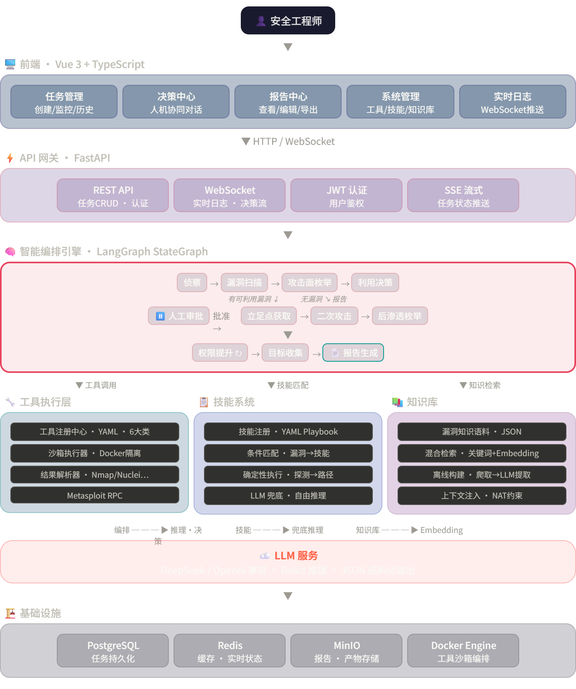

# AuroraRecon：基于大模型的自动化渗透测试系统
项目核心是基于 LangGraph 的攻链编排，配合 Docker 工具沙箱、Skill 引擎、知识库检索，实现从侦察到报告的闭环。
## 核心技术栈
- 前端：Vue3+TypeScript+ElementUI
- 后端：FastAPI
- 核心编排引擎：LangGraph
- 持久层服务：Redis,PostgreSQL,MinIO


## 1) 架构总览



## 4) 支持工具（当前注册）

> 工具由 `backend/tools/definitions/*.yaml` 注册，可按 YAML 扩展。

### Recon
`nmap`, `masscan`, `gobuster`, `ffuf`, `subfinder`, `whatweb`, `httpx`, `wafw00f`, `dirb`, `sslscan`

### Vuln Scan
`nuclei`, `nikto`, `sqlmap`, `wpscan`

### Exploit
`jndi_fastjson`, `bcel_fastjson`, `hydra`, `medusa`, `john`, `hashcat`

### General / Post Exploit
`curl`, `wget`, `python3`, `java`, `socat`, `nc`, `enum4linux`, `smbclient`, `tcpdump`, `hping3`

此外，toolbox 镜像内还预装了 `metasploit-framework`、`tshark`、`dnsrecon`、`arjun`、`paramspider` 等，可按需接入注册表。

## 5) 技术栈

- **Backend**: FastAPI, LangGraph, LangChain, SQLAlchemy Async, Redis, MinIO
- **Frontend**: Vue 3, Vite, Pinia, Element Plus, Axios
- **Runtime**: Docker, Docker Compose
- **LLM Router**: DeepSeek / OpenAI / Anthropic（OpenAI-compatible 接口）

## 6) 快速启动

### 环境要求

- Python `>= 3.11`
- Node.js `>= 18`
- Docker / Docker Compose
- 可用的 LLM API Key

### Step 1. 构建工具箱镜像

```bash
cd docker/toolbox
docker build -t pentest-toolbox:latest .
cd ../..
```

### Step 2. 配置环境变量

Linux/macOS:

```bash
cp .env.example docker/.env
```

Windows (PowerShell):

```powershell
Copy-Item .env.example docker/.env
```

至少修改 `docker/.env` 中的以下值：

- `LLM_API_KEY`
- `LHOST`（反弹连接地址）
- `POSTGRES_PASSWORD` / `MSF_PASSWORD`（建议改默认）

### Step 3. 启动后端服务栈

```bash
cd docker
docker compose up -d
```

默认会启动：`api`、`postgres`、`redis`、`minio`、`msf`。  
前端服务在 compose 中默认注释，建议开发时本地运行。

### Step 4. 启动前端

```bash
cd frontend
npm install
npm run dev
```

默认访问：

- Frontend: [http://localhost:3000](http://localhost:3000)
- API Docs: [http://localhost:8000/docs](http://localhost:8000/docs)
- Health: [http://localhost:8000/health](http://localhost:8000/health)
- MinIO Console: [http://localhost:9001](http://localhost:9001)

## 7) 本地开发（不走 API 容器）

后端：

```bash
pip install -r requirements.txt
uvicorn backend.api.main:app --reload --port 8000
```

前端：

```bash
cd frontend
npm install
npm run dev
```

`vite` 已将 `/api` 与 `/ws` 代理到 `http://localhost:8000`。

## 8) 关键 API（节选）

### 任务与执行

- `POST /tasks`
- `GET /tasks`
- `GET /tasks/{task_id}`
- `POST /tasks/{task_id}/cancel`
- `POST /tasks/{task_id}/approve`
- `WS /ws/{task_id}`

### 指标与系统

- `GET /health`
- `GET /metrics/overview`

### Skill / Knowledge

- `GET /skills`
- `PUT /skills/{skill_id}/raw`
- `GET /knowledge/entries`
- `PUT /knowledge/{vuln_id}/raw`

## 9) 项目结构（精简）

```text
backend/
  agents/         # 编排器与各阶段 Agent
  api/            # FastAPI 入口与全部路由
  tools/          # 执行器、注册表、工具定义 YAML
  skills/         # Skill 模型、加载、匹配、执行引擎
  knowledge/      # 知识库与检索器
  report/         # Markdown 报告生成
  db/             # PostgreSQL / Redis 持久化
  storage/        # MinIO 客户端

frontend/src/
  views/          # 页面（任务、决策、报告、工具、技能、知识等）
  components/     # 可视化与编辑组件
  stores/         # Pinia 状态管理
  api/            # Axios API 封装

docker/
  docker-compose.yml
  api/
  toolbox/
```

## 10) 合规声明

本项目仅用于 **合法授权** 的安全测试场景（CTF、内网演练、授权渗透测试）。  
禁止在未获授权的目标上使用本系统，使用者需自行承担合规责任。

## License

MIT
