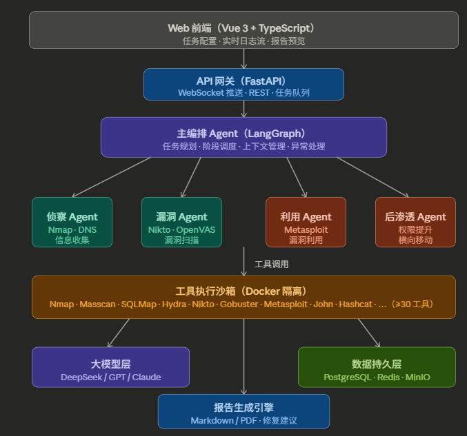

# PentestAI 部署文档

> 本系统仅限合法授权的 CTF 靶场、安全研究及竞赛演示场景使用，严禁用于任何未授权测试。

---

## 目录

1. [环境要求](#1-环境要求)
2. [项目结构总览](#2-项目结构总览)
3. [快速启动（开发调试）](#3-快速启动开发调试)
4. [生产部署（Docker Compose）](#4-生产部署docker-compose)
5. [靶场环境搭建](#5-靶场环境搭建)
6. [环境变量说明](#6-环境变量说明)
7. [验证系统运行](#7-验证系统运行)
8. [公网部署指南](#8-公网部署指南)
9. [常见问题排查](#9-常见问题排查)
10. [实验步骤：打一个 Vulhub 靶场](#10-实验步骤打一个-vulhub-靶场)

---

## 1. 环境要求

### 宿主机要求

| 项目 | 最低要求 | 推荐 |
|------|---------|------|
| 操作系统 | Ubuntu 20.04 / Debian 11 | Ubuntu 22.04 LTS |
| CPU | 4 核 | 8 核 |
| 内存 | 8 GB | 16 GB |
| 磁盘 | 50 GB | 100 GB SSD |
| Docker | 24.x+ | 最新版 |
| Docker Compose | v2.20+ | 最新版 |
| Python | 3.11+ | 3.11 |

### 网络要求

- 宿主机能访问公网（拉取镜像、调用 DeepSeek API）
- 工具容器与靶场容器在同一 Docker 网络（`pentest_net`）

---

## 2. 项目结构总览

```
pentest-ai/
├── backend/
│   ├── agents/
│   │   ├── orchestrator.py      # 主编排 + 全局状态定义
│   │   ├── recon_agent.py       # 侦察 Agent
│   │   ├── vuln_agent.py        # 漏洞扫描 Agent
│   │   ├── exploit_agent.py     # 漏洞利用 Agent
│   │   └── post_agent.py        # 后渗透 Agent
│   ├── tools/
│   │   ├── executor.py          # 通用 Docker 工具执行器
│   │   ├── msf_client.py        # Metasploit RPC 客户端
│   │   └── parsers/
│   │       ├── nmap_parser.py
│   │       ├── nuclei_parser.py
│   │       ├── gobuster_parser.py
│   │       └── nikto_parser.py
│   ├── llm/
│   │   └── router.py            # LLM 统一路由（DeepSeek/GPT/Claude）
│   ├── report/
│   │   └── generator.py         # Jinja2 报告生成器
│   └── api/
│       └── main.py              # FastAPI + WebSocket
├── docker/
│   ├── toolbox/Dockerfile       # 安全工具箱镜像（含 50+ 工具）
│   ├── api/Dockerfile           # 后端 API 镜像
│   └── docker-compose.yml       # 一键启动全套服务
├── requirements.txt
├── .env.example
└── docs/
    └── DEPLOY.md                # 本文档
```

---

## 3. 快速启动（开发调试）

适合本地验证功能，工具直接在宿主机运行（跳过 Docker 隔离）。

### 3.1 克隆并进入项目

```bash
git clone <your-repo-url> pentest-ai
cd pentest-ai
```

### 3.2 创建 Python 虚拟环境

```bash
python3.11 -m venv .venv
source .venv/bin/activate
pip install --upgrade pip
pip install -r requirements.txt
```

### 3.3 配置环境变量

```bash
cp .env.example .env
vim .env
```

至少需要填写：

```env
LLM_API_KEY=sk-your-deepseek-api-key
USE_HOST_TOOLS=true          # 开发模式：工具直接在宿主机跑
MSF_HOST=127.0.0.1
MSF_PASSWORD=pentest123
LHOST=127.0.0.1              # 本地测试用 127.0.0.1 即可
```

### 3.4 安装 Nmap（宿主机，用于 USE_HOST_TOOLS=true 模式）

```bash
# Ubuntu/Debian
sudo apt-get install -y nmap nuclei gobuster nikto hydra

# 安装 Nuclei（Go 工具，如果 apt 版本太旧）
go install github.com/projectdiscovery/nuclei/v3/cmd/nuclei@latest
nuclei -update-templates
```

### 3.5 启动 API 服务

```bash
# 加载 .env 并启动
set -a && source .env && set +a
uvicorn backend.api.main:app --host 0.0.0.0 --port 8000 --reload
```

### 3.6 测试 API

```bash
# 创建一个测试任务
curl -X POST http://localhost:8000/tasks \
  -H "Content-Type: application/json" \
  -d '{"target": "127.0.0.1", "scope_note": "本地测试"}'

# 查询任务状态（替换 task_id）
curl http://localhost:8000/tasks/<task_id>
```

---

## 4. 生产部署（Docker Compose）

### 4.1 安装 Docker & Docker Compose

```bash
# 安装 Docker
curl -fsSL https://get.docker.com | bash
sudo usermod -aG docker $USER
newgrp docker

# 验证
docker --version          # Docker version 24.x+
docker compose version    # Docker Compose version v2.x+
```

### 4.2 构建工具箱镜像

> ⚠️ 这一步耗时较长（约 15-30 分钟），因为要安装 Kali 工具链。

```bash
cd pentest-ai/docker/toolbox
docker build -t pentest-toolbox:latest .
```

构建完成后验证：

```bash
docker run --rm pentest-toolbox:latest nmap --version
docker run --rm pentest-toolbox:latest nuclei -version
```

### 4.3 配置 .env 文件

```bash
cd pentest-ai
cat > .env << 'EOF'
# === 必填 ===
LLM_API_KEY=sk-your-deepseek-api-key-here
LHOST=your.server.public.ip          # 服务器公网 IP，用于反弹 Shell 接收

# === 可选修改 ===
LLM_PROVIDER=deepseek
LLM_MODEL=deepseek-chat
MSF_PASSWORD=change-this-password     # MSF RPC 密码（修改为强密码）

# === 一般不需要修改 ===
DOCKER_NETWORK=pentest_net
TOOLBOX_IMAGE=pentest-toolbox:latest
USE_HOST_TOOLS=false
EOF
```

### 4.4 创建 Docker 网络

```bash
docker network create pentest_net
```

### 4.5 启动所有服务

```bash
cd pentest-ai/docker
docker compose --env-file ../.env up -d
```

### 4.6 查看启动状态

```bash
docker compose ps

# 预期输出：
# NAME                STATUS
# pentest_api         running
# pentest_msf         running
# pentest_redis       running
# pentest_frontend    running
```

### 4.7 查看日志

```bash
# 查看 API 日志
docker compose logs -f api

# 查看 MSF 日志
docker compose logs -f msf
```

---

## 5. 靶场环境搭建

靶场容器必须加入 `pentest_net` 网络，才能被工具箱扫描到。

### 5.1 Vulhub 靶场（推荐优先调试）

```bash
# 克隆 Vulhub
git clone https://github.com/vulhub/vulhub.git /opt/vulhub
cd /opt/vulhub

# 示例：启动 Shiro CVE-2016-4437
cd shiro/CVE-2016-4437
docker compose up -d

# 将靶场容器加入 pentest_net
# 方法一：修改 docker-compose.yml，添加 networks: pentest_net（推荐）
# 方法二：运行后手动加入
docker network connect pentest_net <container_name>

# 获取靶场容器 IP
docker inspect <container_name> | grep '"pentest_net"' -A 5 | grep IPAddress
```

**批量将 Vulhub 靶场接入 pentest_net 的脚本：**

```bash
#!/bin/bash
# 将所有运行中的 vulhub 容器接入 pentest_net
for cid in $(docker ps -q); do
  name=$(docker inspect $cid --format '{{.Name}}')
  if echo "$name" | grep -q "vulhub\|vulnhub"; then
    docker network connect pentest_net $cid 2>/dev/null && \
      echo "已连接: $name"
  fi
done
```

### 5.2 Vulnhub 靶机（OVA 虚拟机）

Vulnhub 靶机是 OVA 格式，需要通过 VMware/VirtualBox 运行，然后配置宿主机可达：

```bash
# 在 VirtualBox 中：
# 1. 导入 OVA 文件
# 2. 网络设置 → Host-only Adapter
# 3. 记录靶机 IP（通常在 192.168.56.x 段）

# 验证宿主机可达
ping 192.168.56.101

# 然后直接用靶机 IP 创建任务
curl -X POST http://localhost:8000/tasks \
  -d '{"target": "192.168.56.101", "scope_note": "Vulnhub Tomato 靶场"}'
```

---

## 6. 环境变量说明

| 变量名 | 默认值 | 说明 |
|--------|--------|------|
| `LLM_PROVIDER` | `deepseek` | 大模型提供商：`deepseek` / `openai` / `anthropic` |
| `LLM_API_KEY` | 必填 | 对应提供商的 API Key |
| `LLM_MODEL` | `deepseek-chat` | 模型名称 |
| `LLM_BASE_URL` | 自动 | 自定义 API 地址（如私有部署） |
| `MSF_HOST` | `127.0.0.1` | MSF RPC 服务地址 |
| `MSF_PORT` | `55553` | MSF RPC 端口 |
| `MSF_PASSWORD` | 必填 | MSF RPC 认证密码 |
| `MSF_SSL` | `false` | MSF RPC 是否启用 SSL |
| `LHOST` | 必填 | 反弹 Shell 接收 IP（攻击机公网 IP） |
| `TOOLBOX_IMAGE` | `pentest-toolbox:latest` | 工具箱镜像名称 |
| `DOCKER_NETWORK` | `pentest_net` | Docker 网络名称 |
| `USE_HOST_TOOLS` | `false` | `true` 时跳过 Docker 直接在宿主机运行工具（仅调试） |
| `REPORTS_DIR` | `/tmp/pentest_reports` | 报告输出目录 |
| `DATA_VOLUME` | `/tmp/pentest_data` | 工具数据共享目录 |

切换为 OpenAI GPT：

```env
LLM_PROVIDER=openai
LLM_API_KEY=sk-your-openai-key
LLM_MODEL=gpt-4o
```

切换为本地 Ollama：

```env
LLM_PROVIDER=openai           # Ollama 也兼容 OpenAI 格式
LLM_API_KEY=ollama
LLM_MODEL=llama3:8b
LLM_BASE_URL=http://localhost:11434/v1
```

---

## 7. 验证系统运行

### 7.1 健康检查

```bash
# API 是否正常
curl http://localhost:8000/docs          # 打开 Swagger UI

# MSF RPC 是否连通
docker exec pentest_msf \
  ruby -e "require 'msfrpc-client'; c = Msf::RPC::Client.new(host:'127.0.0.1',port:55553,pass:'pentest123'); puts c.auth.token"
```

### 7.2 工具箱联通性测试

```bash
# 在工具容器内扫描本机，验证工具可用
docker run --rm --network pentest_net pentest-toolbox:latest \
  nmap -T4 --open -p 80,443,8080 172.17.0.1

# 验证 Nuclei
docker run --rm --network pentest_net pentest-toolbox:latest \
  nuclei -version

# 验证 Gobuster
docker run --rm pentest-toolbox:latest gobuster version
```

### 7.3 端到端冒烟测试

启动一个简单的测试目标（Vulhub Flask SSTI）：

```bash
cd /opt/vulhub/flask/ssti
docker compose up -d
TARGET_IP=$(docker inspect vulhub_flask_ssti_web_1 \
  --format '{{range .NetworkSettings.Networks}}{{.IPAddress}}{{end}}')

# 创建任务
TASK_ID=$(curl -s -X POST http://localhost:8000/tasks \
  -H "Content-Type: application/json" \
  -d "{\"target\": \"$TARGET_IP\", \"scope_note\": \"Flask SSTI 测试\"}" \
  | python3 -c "import sys,json; print(json.load(sys.stdin)['task_id'])")

echo "任务 ID: $TASK_ID"

# 实时查看日志
watch -n 2 "curl -s http://localhost:8000/tasks/$TASK_ID/logs | python3 -m json.tool"
```

---

## 8. 公网部署指南

> 赛题要求提供「可复现运行的公网运行环境地址」，以下是推荐方案。

### 方案 A：云服务器（推荐，最稳定）

**阿里云/腾讯云学生机（99元/年）步骤：**

```bash
# 1. 购买 Ubuntu 22.04 实例，至少 4C8G
# 2. 安全组开放端口：8000（API）、3000（前端）
# 3. SSH 登录后执行：

# 安装 Docker
curl -fsSL https://get.docker.com | bash
sudo usermod -aG docker ubuntu
newgrp docker

# 克隆项目
git clone <your-repo> pentest-ai
cd pentest-ai

# 修改 .env（特别是 LHOST 改为服务器公网 IP）
vim .env

# 构建并启动
cd docker
docker build -t pentest-toolbox:latest toolbox/
docker compose --env-file ../.env up -d

# 验证（浏览器访问）
# http://your-server-ip:3000  前端
# http://your-server-ip:8000/docs  API 文档
```

**配置域名（可选，加分项）：**

```bash
# 安装 Nginx 反向代理
sudo apt install nginx certbot python3-certbot-nginx

# 配置 /etc/nginx/sites-available/pentest-ai
cat > /etc/nginx/sites-available/pentest-ai << 'EOF'
server {
    listen 80;
    server_name your-domain.com;

    location /api/ {
        proxy_pass http://localhost:8000/;
        proxy_set_header Upgrade $http_upgrade;
        proxy_set_header Connection "upgrade";   # WebSocket 支持
        proxy_set_header Host $host;
    }

    location / {
        proxy_pass http://localhost:3000;
    }
}
EOF

sudo ln -s /etc/nginx/sites-available/pentest-ai /etc/nginx/sites-enabled/
sudo nginx -t && sudo systemctl reload nginx
```

### 方案 B：Railway 免费部署（无服务器，适合纯 API 展示）

```bash
# 安装 Railway CLI
npm install -g @railway/cli
railway login
railway init
railway up
```

注意：Railway 免费版不支持 Docker Socket 挂载，工具执行需改为 `USE_HOST_TOOLS=false` 并在镜像内预装工具。

---

## 9. 常见问题排查

### Q1：Nmap 扫描结果为空

```bash
# 检查容器是否在同一网络
docker network inspect pentest_net

# 手动测试连通性
docker run --rm --network pentest_net pentest-toolbox:latest \
  nmap -T4 -p 80 <目标IP>

# 如果靶场 IP 不可达，重新连接网络
docker network connect pentest_net <靶场容器名>
```

### Q2：Nuclei 扫描无结果

```bash
# 更新模板
docker run --rm -v nuclei_templates:/root/nuclei-templates \
  pentest-toolbox:latest nuclei -update-templates

# 手动测试
docker run --rm --network pentest_net pentest-toolbox:latest \
  nuclei -u http://<目标IP>:8080 -tags shiro -debug
```

### Q3：MSF RPC 连接失败

```bash
# 查看 MSF 容器日志
docker logs pentest_msf

# 手动测试 RPC 连通性
docker exec pentest_api \
  python3 -c "
from pymetasploit3.msfrpc import MsfRpcClient
c = MsfRpcClient('pentest123', server='msf', port=55553, ssl=False)
print('连接成功:', c.core.version)
"

# 常见原因：MSF 还在初始化数据库（等待约 30 秒后重试）
docker logs pentest_msf | tail -20
```

### Q4：LLM API 调用失败

```bash
# 测试 DeepSeek API 连通性
curl https://api.deepseek.com/v1/models \
  -H "Authorization: Bearer $LLM_API_KEY"

# 检查 .env 中的 API Key 是否正确设置
docker exec pentest_api env | grep LLM
```

### Q5：工具箱镜像构建失败

```bash
# Go 工具安装失败（网络问题），单独重试
docker build --no-cache \
  --build-arg GOPROXY=https://goproxy.cn,direct \
  -t pentest-toolbox:latest docker/toolbox/

# 或者跳过失败的 Go 工具，注释掉 Dockerfile 中对应行
```

### Q6：端口冲突

```bash
# 查看占用情况
sudo ss -tlnp | grep -E '8000|3000|55553|6379'

# 在 docker-compose.yml 中修改宿主机端口映射
# 如：8000:8000 改为 18000:8000
```

---

## 10. 实验步骤：打一个 Vulhub 靶场

以 **Shiro CVE-2016-4437** 为例，完整演示一次自动化渗透测试。

### 步骤 1：启动靶场

```bash
cd /opt/vulhub/shiro/CVE-2016-4437
docker compose up -d

# 将靶场接入 pentest_net
docker network connect pentest_net cve-2016-4437-web-1

# 获取靶场 IP
TARGET_IP=$(docker inspect cve-2016-4437-web-1 \
  --format '{{range .NetworkSettings.Networks}}{{.IPAddress}}{{end}}' \
  | tr ' ' '\n' | grep -v '^$' | tail -1)
echo "靶场 IP: $TARGET_IP"
```

预期结果：靶场 IP 如 `172.20.0.5`，访问 `http://$TARGET_IP:8080` 可看到 Shiro 登录页面。

### 步骤 2：启动 PentestAI 服务

```bash
cd pentest-ai/docker
docker compose --env-file ../.env up -d
# 等待约 30 秒让 MSF 完成数据库初始化
sleep 30
```

### 步骤 3：创建渗透测试任务

```bash
RESPONSE=$(curl -s -X POST http://localhost:8000/tasks \
  -H "Content-Type: application/json" \
  -d "{
    \"target\": \"$TARGET_IP\",
    \"scope_note\": \"Vulhub Shiro CVE-2016-4437 授权测试\"
  }")

TASK_ID=$(echo $RESPONSE | python3 -c "import sys,json; print(json.load(sys.stdin)['task_id'])")
echo "任务已创建，ID: $TASK_ID"
```

### 步骤 4：实时监控执行过程

```bash
# 方式一：轮询状态
watch -n 3 "curl -s http://localhost:8000/tasks/$TASK_ID | python3 -m json.tool"

# 方式二：WebSocket 日志（推荐）
# 在浏览器控制台中运行：
# const ws = new WebSocket('ws://localhost:8000/ws/<TASK_ID>');
# ws.onmessage = e => console.log(JSON.parse(e.data));

# 方式三：查看全量日志
curl -s http://localhost:8000/tasks/$TASK_ID/logs | python3 -m json.tool
```

### 步骤 5：查看报告

```bash
# 等待任务完成（status 变为 completed）
until curl -s http://localhost:8000/tasks/$TASK_ID | python3 -c \
  "import sys,json; s=json.load(sys.stdin); exit(0 if s['status']=='completed' else 1)"; do
  echo "等待任务完成..."; sleep 5
done

# 获取并保存报告
curl -s http://localhost:8000/tasks/$TASK_ID/report \
  | python3 -c "import sys,json; print(json.load(sys.stdin)['markdown'])" \
  > shiro_report.md

echo "报告已保存到 shiro_report.md"
cat shiro_report.md
```

### 预期结果

```
✅ 侦察：发现 8080 端口，识别 Apache Shiro 框架
✅ 漏洞扫描：Nuclei 命中 CVE-2016-4437（Shiro 反序列化 RCE）
✅ 利用：MSF 模块执行成功，获得反弹 Shell
✅ 后渗透：当前用户 root，获取 /etc/shadow
✅ 报告：生成包含修复建议的完整报告
```

---

## 附录：`.env.example` 模板

```env
# 大模型配置（必填）
LLM_PROVIDER=deepseek
LLM_API_KEY=sk-your-api-key-here
LLM_MODEL=deepseek-chat
LLM_BASE_URL=
LLM_MAX_TOKENS=4096

# Metasploit RPC（必填）
MSF_HOST=msf
MSF_PORT=55553
MSF_PASSWORD=change-this-strong-password
MSF_SSL=false

# 网络配置（必填：改为实际服务器 IP）
LHOST=1.2.3.4

# Docker 配置
TOOLBOX_IMAGE=pentest-toolbox:latest
DOCKER_NETWORK=pentest_net
USE_HOST_TOOLS=false

# 存储
REPORTS_DIR=/reports
DATA_VOLUME=/tmp/pentest_data
```
